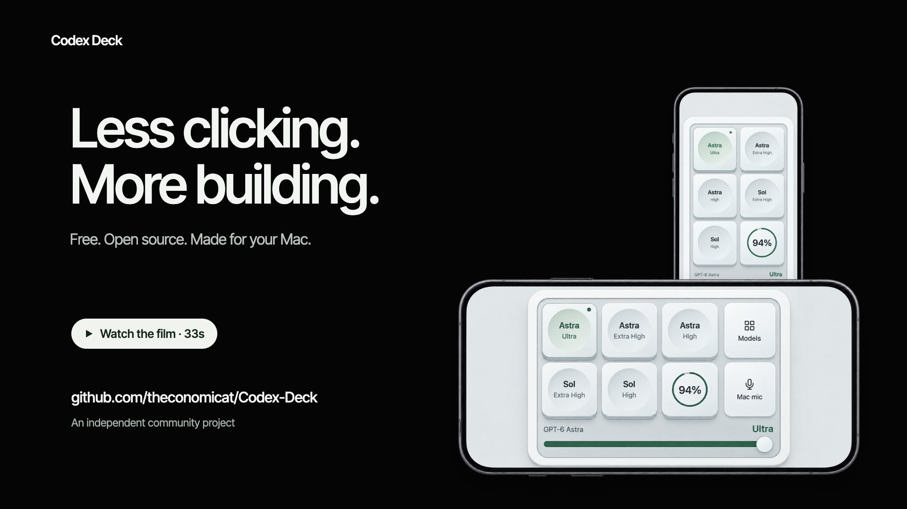
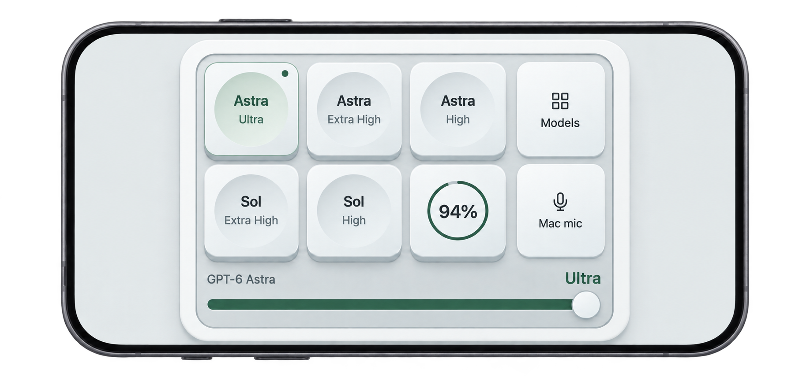
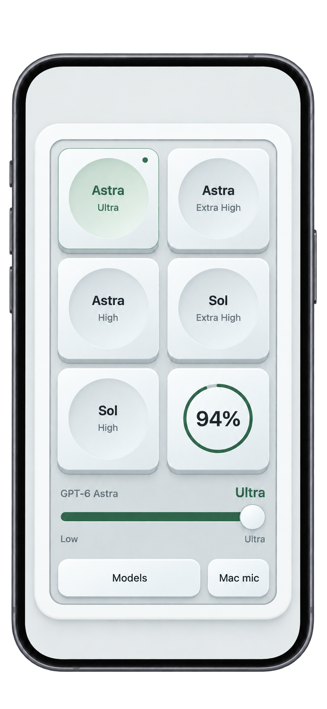

# Codex Deck

**[English](README.md) · 한국어**

**자주 쓰는 Codex 모델을 단축키나 한 번의 탭으로.**

모델과 추론 수준을 미리 저장하고, 키보드나 휴대폰에서 바로 전환하세요. 남은 사용량도 한눈에 확인하는 무료 macOS 오픈소스 보조 도구입니다.

[](https://github.com/theconomicat/Codex-Deck/raw/refs/heads/main/docs/media/codex-deck-intro.mp4)

**[33초 소개 영상 보기 →](https://github.com/theconomicat/Codex-Deck/raw/refs/heads/main/docs/media/codex-deck-intro.mp4)** · 영어 내레이션 · [영어 자막](docs/media/codex-deck-intro.en.srt)

<details>
<summary>휴대폰 가로·세로 화면</summary>

<p align="center">


</p>

<sub>앱의 오프라인 예시 화면으로 만든 휴대폰 목업입니다. 사용량은 예시입니다.</sub>

</details>

- **빠른 전환:** `⌘⌃1–5`와 휴대폰 덱에서 같은 프리셋을 사용합니다.
- **휴대폰 조작:** 같은 Wi-Fi에서 모델 선택과 추론 수준 조절. Mac 받아쓰기와 지원되는 질문·승인 응답도 가능합니다.
- **사용량 확인:** 덱과 Mac 메뉴 막대에서 남은 비율을 확인합니다.

## Mac에서도 한눈에

메뉴 막대에서 남은 사용량을 확인하고, 메뉴를 열어 모델 프리셋·설정·자동 실행을 관리하세요.

<p align="center">
<br />

</p>

<sub>메뉴는 이전 버전 캡처입니다. 현재 앱에서는 Edit Button Settings…로 JSON을 바로 엽니다.</sub>

## 시작하기

**macOS 13+**, 로그인한 **Codex 데스크톱 앱**, Xcode 또는 Command Line Tools의 **Swift 6**가 필요합니다. 현재 덱은 아래 소스 빌드로 설치하세요. 이전 릴리스 다운로드에는 이 조작 기능이 없습니다.

```bash
git clone https://github.com/theconomicat/Codex-Deck.git
cd Codex-Deck
./Scripts/package_app.sh
```

1. 생성된 **Codex Deck.app**을 `/Applications`로 옮겨 실행합니다. 메뉴 막대에 아이콘이 나타납니다.
2. Codex의 진행 중인 작업을 마친 뒤, **Enable Direct Switching…**에서 연결합니다. **이 과정에서 Codex가 재시작됩니다.**
3. 입력창이 보이는 채팅을 열고, Codex가 맨 앞인 상태에서 `⌘⌃1`을 눌러 보세요.

사용량만 볼 때는 직접 전환 연결이 필요 없습니다. [설치 도움말 →](docs/guide.ko.md#설치)

## 휴대폰에서 사용하기

1. Mac을 깨어 있게 두고 두 기기를 **같은 신뢰할 수 있는 Wi-Fi**에 연결합니다. Codex에는 저장된 채팅을 열어 둡니다.
2. Mac 메뉴의 **Web Deck… → Start Web Deck**을 누르고 QR 코드를 스캔합니다.
3. 프리셋을 누르면 적용됩니다. 가로바로 추론 수준을 바꾸거나 **Models**에서 다른 모델을 고르세요.

퍼센트 게이지를 누르면 사용량 상세와 전체화면 옵션이 나옵니다. 보조 앱을 재시작했다면 Web Deck을 켜고 다시 연결하세요. [연결 도움말 →](docs/guide.ko.md#휴대폰-연결)

## 내 방식으로 설정하기

Mac 메뉴의 **Edit Button Settings…**에서 JSON 파일을 바로 엽니다.

| 단축키 | 기본 프리셋 |
| --- | --- |
| `⌘⌃1` | Astra · Ultra |
| `⌘⌃2` | Astra · Extra High |
| `⌘⌃3` | Astra · High |
| `⌘⌃4` | Sol 6.1 · Extra High |
| `⌘⌃5` | Sol 6.1 · High |

예를 들어 첫 번째 항목의 웹 버튼 이름을 바꾸려면:

```json
{ "slot": 1, "model": "GPT-6 Astra", "effort": "ultra", "label": "집중" }
```

`slot`은 덱 위치와 단축키 번호, `model`과 `effort`는 모델과 추론 수준입니다. 선택 항목인 `label`은 웹 버튼 이름만 바꿉니다. 저장하면 다음 단축키나 웹 갱신 때 반영되며, **Reload Button Settings**로 Mac 메뉴도 바로 갱신할 수 있습니다.

[전체 JSON 예제](presets.example.json) · [설정 가이드](docs/guide.ko.md#버튼-설정)

## 만든 이유

사용량 확인이나 모델·추론 수준 변경 때문에 매번 마우스를 움직여 메뉴를 여는 게 번거로웠습니다. 자주 쓰는 조합을 한 번에 적용하고 싶었고, Codex Micro에서 영감을 받아 이미 가진 휴대폰을 덱으로 만들었습니다.

---

모델 조작은 Codex 내부 구조를 사용해 앱 업데이트에 영향을 받을 수 있습니다. 휴대폰 연결은 로컬 HTTP이므로 신뢰하는 Wi-Fi에서 사용하세요. OpenAI의 공식 제품이 아닌 독립 프로젝트입니다.

[도움말·문제 해결](docs/guide.ko.md) · [고급 조작 안내](docs/codex-micro.md) · [보안](SECURITY.md) · [기여하기](CONTRIBUTING.md) · [MIT 라이선스](LICENSE)
