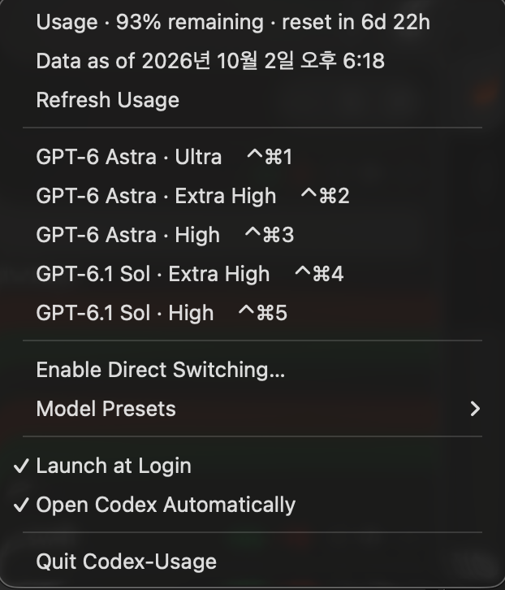
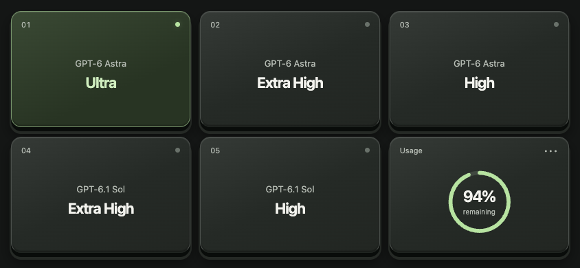
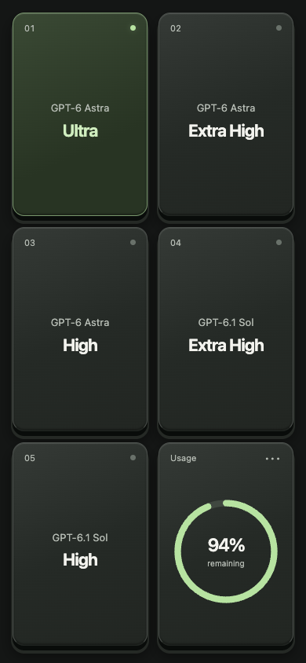

# Codex-Usage

[English](README.md)

Codex의 **남은 사용량**, **모델 전환 단축키**, **휴대폰 Web Deck**을 한곳에서 관리하는 macOS 메뉴 막대 앱입니다.
모델 선택창을 열지 않고 현재 채팅의 모델과 추론 강도를 함께 바꿉니다. 키보드나 같은 Wi-Fi에 연결된 휴대폰 브라우저의 버튼 다섯 개를 사용할 수 있습니다. Stream Deck 같은 별도 하드웨어는 필요하지 않습니다.

## 화면 예시

### 앱 메뉴



사용자가 촬영한 0.5.0 앱의 메뉴입니다. 단축키 다섯 개는 한 묶음이며, 프리셋 편집은 별도 하위 메뉴에 있습니다. 주간 한도만 있을 때는 `1w` 대신 `Usage`로 표시합니다.

### 메뉴 막대 사용량


사용자가 촬영한 주간 한도 화면입니다. 초록색 게이지의 94는 남은 사용량 94%를 뜻하며, 옆의 Codex 아이콘은 Codex 앱 자체의 아이콘입니다. 수치는 로컬 Codex 사용량 기록에 따라 갱신됩니다.

### 휴대폰 Web Deck





0.7.0의 가로·세로 화면을 가상의 오프라인 테스트 데이터(94% 남음)로 촬영했습니다. 실제 휴대폰에서 Codex를 제어하는 사진은 아닙니다.

---

## 기본 단축키

`⌘`는 Command, `⌃`는 Control입니다. 두 키를 누른 상태에서 숫자를 눌렀다 떼세요.

| 단축키 | 모델 | 추론 강도 | JSON 값 |
| --- | --- | --- | --- |
| `⌘⌃1` | GPT-6 Astra | Ultra | `ultra` |
| `⌘⌃2` | GPT-6 Astra | Extra High | `xhigh` |
| `⌘⌃3` | GPT-6 Astra | High | `high` |
| `⌘⌃4` | GPT-6.1 Sol | Extra High | `xhigh` |
| `⌘⌃5` | GPT-6.1 Sol | High | `high` |

단축키는 **Codex가 맨 앞에 있을 때만** 작동합니다. 다른 앱에서는 해당 앱의 단축키를 그대로 사용할 수 있습니다.
계정에서 이용할 수 있는 모델과 추론 강도만 적용됩니다. Ultra가 없는 모델에서는 오류를 표시하며 다른 강도로 대신 적용하지 않습니다.

## 1. 설치

### 앱으로 설치하기

1. [Releases](https://github.com/theconomicat/Codex-Usage/releases)에서 사용할 버전의 `Codex-Usage-macos.zip`을 받습니다.
   **Web Deck은 0.6.0부터**, 키보드 프리셋 5개는 0.4.0부터 지원합니다. 공개 릴리즈에 해당 버전이 아직 없다면 아래 소스 빌드를 사용하세요.
2. ZIP을 풀고 `Codex-Usage.app`을 **응용 프로그램(`/Applications`)**으로 옮깁니다.
3. 이전 버전이 실행 중이면 메뉴 막대에서 **Quit Codex-Usage**로 종료한 뒤 새 앱을 엽니다.
4. 메뉴 막대의 Codex-Usage 아이콘을 클릭합니다. 일반 앱처럼 Dock에 창이 계속 표시되지 않는 것이 정상입니다.

macOS 13 이상과 설치·로그인된 Codex 데스크톱 앱이 필요합니다. 사용량만 보려면 아래 직접 전환 설정을 생략할 수 있습니다.
로컬 빌드는 임시 서명이며 Apple 공증을 포함하지 않습니다. macOS가 실행을 차단한다면 출처를 확인한 후 시스템 설정의 개인정보 보호 및 보안에서 해당 앱의 실행 허용 항목을 확인하세요.

### 소스에서 빌드하기

Swift 6을 지원하는 Xcode/Command Line Tools와 Git이 필요합니다. Node.js 22 이상은 JavaScript 테스트에만 필요하며, 배포된 앱을 실행할 때는 필요 없습니다.
외부 Swift 패키지나 npm 의존성은 없습니다.

```bash
git clone https://github.com/theconomicat/Codex-Usage.git
cd Codex-Usage
./Scripts/package_app.sh
```

생성된 `Codex-Usage.app`을 `/Applications`로 옮겨 실행하세요. 이미 설치돼 있다면 먼저 이전 앱을 종료하고 교체합니다.

## 2. 직접 모델 전환 연결 — 처음 한 번

1. Codex에서 실행 중인 작업을 마칩니다. 다음 과정에서 **Codex가 재시작**됩니다.
2. Codex-Usage 메뉴에서 **Enable Direct Switching…**을 누릅니다. 첫 실행에는 설정 창이 자동으로 열립니다.
3. 설정 창에서 **Codex 재시작 · 직접 전환 연결**을 누릅니다.
4. Codex가 다시 열리면 기본 창 하나에서 원하는 채팅을 선택합니다. 모델/추론 강도 버튼이 있는 입력창이 보여야 합니다.
5. 예를 들어 `⌘⌃4`를 눌렀다 떼면 **GPT-6.1 Sol · Extra High**가 적용됩니다.

성공하면 메뉴 막대에 프리셋 이름이 잠시 표시되고, 메뉴의 상태에 `Applied:`가 나타납니다.
설정 창의 실행 완료 안내만으로 모델 변경까지 성공한 것은 아닙니다. 첫 단축키 실행 때 연결과 두 설정값을 확인합니다.

**손쉬운 사용(Accessibility) 권한은 필요하지 않습니다.** 이전 버전에서 허용했더라도 현재 직접 전환 모드는 그 권한을 사용하지 않습니다.
`Control–Shift–M`이나 모델 선택창을 열어 둘 필요도 없습니다.

이 모드는 같은 Mac의 `127.0.0.1` 주소에 디버깅 연결을 열어 Codex 내부의 기존 모델 변경 함수를 호출합니다.
이 연결은 별도 인증 없이 로컬 프로세스에 강한 접근 권한을 제공합니다. 활성화 전에 [보안 설명](SECURITY.md)을 확인하세요.
Codex를 완전히 종료한 뒤 일반 실행하면 연결을 닫을 수 있습니다.

## 3. 평소 사용하기

- 변경할 Codex 채팅을 클릭하고 `⌘⌃1`~`⌘⌃5`를 눌렀다 뗍니다. 성공 시 모델 선택 팝업이 열리지 않습니다.
- 현재 입력창의 모델과 추론 강도를 함께 변경합니다. 이미 생성 중인 답변을 다시 실행하거나 메시지를 전송하지 않습니다. 변경된 설정은 이후 턴에 사용됩니다.
- 작성 중인 프롬프트를 입력하거나 지우지 않습니다. Codex가 별도 확인을 요구하면 해당 확인을 완료한 뒤 다시 실행하세요.
- **Launch at Login**과 **Open Codex Automatically**를 켜면 로그인 시 보조 앱이 시작되고, Codex가 닫혀 있다면 연결 모드로 자동 실행됩니다. 최초 직접 연결을 한 번 완료해야 하며, 이미 연결한 사용자는 Codex 자동 실행이 기본으로 켜집니다.
- Codex를 Dock에서 다시 실행하거나 업데이트해 연결이 끊기면 **Enable Direct Switching…**으로 다시 연결합니다.

### 로그인할 때 자동으로 연결하기

1. 위의 직접 전환 연결을 한 번 완료합니다.
2. 메뉴에서 **Launch at Login**과 **Open Codex Automatically** 두 항목에 체크가 있는지 확인합니다.
3. 다음 로그인 때 Codex-Usage가 시작되면서 Codex를 로컬 연결 옵션으로 엽니다. 별도 연결 버튼을 누를 필요가 없습니다.

Codex가 이미 연결 모드로 실행 중이면 그대로 사용합니다. 다른 경로로 실행된 Codex가 먼저 열려 있으면 작업 보호를 위해 자동으로 종료하지 않고 재연결 안내를 표시합니다.
이 경우 작업을 마친 뒤 **Enable Direct Switching…**을 사용하세요. 자동 실행은 보조 앱이 시작될 때 한 번만 시도하며, 사용자가 Codex를 닫아도 계속 다시 열지 않습니다.
**Open Codex Automatically**를 끄면 사용량 앱만 자동 실행할 수 있습니다. Codex가 이미 열린 상태에서 옵션을 켜도 강제로 재시작하지 않습니다.

### 휴대폰을 Web Deck으로 사용하기

1. Mac에서 **Enable Direct Switching…** 연결을 먼저 완료합니다. Codex 기본 창 하나에서 **저장된 채팅**을 열고 입력창이 보이게 둡니다. Web Deck은 Mac의 다른 앱이 맨 앞에 있어도 사용할 수 있습니다. 키보드 단축키는 계속 Codex가 맨 앞에 있을 때만 작동합니다.
2. Mac과 휴대폰을 **같은 신뢰할 수 있는 개인 Wi-Fi**에 연결합니다. Mac을 깨어 있는 상태로 두고 Codex-Usage를 실행해 둡니다.
3. Mac 메뉴에서 **Web Deck… → Start Web Deck**을 누릅니다. 로컬 HTTP 서버가 시작됩니다. 기본값은 꺼짐이며 로그인할 때 자동으로 켜지지 않습니다.
4. 휴대폰 카메라로 QR 코드를 읽거나 **Copy Pairing Link**로 복사한 전체 링크를 휴대폰 브라우저에서 엽니다. IP 주소만 열면 페이지는 나오지만 기기 연결은 되지 않습니다.
5. **Usage** 타일을 눌러 대상 채팅을 확인하고 설정 창을 닫은 뒤 모델 키를 누릅니다. 단축키와 같은 `presets.json`에서 슬롯 순서대로 처음 5개 프리셋을 사용합니다. Mac이 선택 결과를 확인하면 키가 초록색으로 바뀝니다.
6. 기기를 가로로 돌리면 **3열 × 2행**, 세로에서는 **2열 × 3행**입니다. 헤더·설명 없이 모델 키 5개와 사용량 타일이 화면을 채웁니다.
7. **Usage → Enter full screen**을 누르면 지원 브라우저에서 전체화면으로 전환됩니다. iPhone에서는 Safari의 **공유 → 홈 화면에 추가** 후 저장된 덱을 여세요. 별도 브라우저 세션으로 열리면 다시 페어링합니다.

키는 입체적인 테두리와 짧은 눌림 효과, 클릭음, 지원 기기의 진동으로 반응합니다. **Usage → Sound on/off**에서 효과음을 끌 수 있고 브라우저 저장소를 사용할 수 있으면 설정을 기억합니다. 오디오는 사용자가 누른 뒤 생성되고 클릭음 직후 정지됩니다. 동작 줄이기 설정에서는 키가 움직이지 않습니다. 전체화면·진동은 기기와 브라우저에 따라 지원 여부가 다르며, 지원하지 않아도 모델 변경은 작동합니다.

마지막 타일은 **남은 사용량**을 원형으로 표시합니다. 주간 한도가 있으면 우선 사용하고, 없으면 첫 번째 한도를 사용합니다. 타일을 누르면 전체 사용량과 초기화 정보를 확인할 수 있습니다. 데이터 없음·만료·연결 끊김은 **—**로 표시합니다. 연결과 오류 안내는 필요한 순간에만 나타납니다.

연결 링크는 **5분 동안 유효하며 한 번만 사용**할 수 있습니다. 시간이 지났거나 다른 기기도 연결하려면 **New Pairing Link**를 누르세요. 이미 연결된 기기의 세션은 유지됩니다. 연결된 브라우저 세션은 최대 **8시간** 동안 유효합니다. 연결 링크는 다른 사람에게 공개하지 마세요.

**Disconnect All Devices**는 모든 기기의 세션을 해제하고 새 링크를 만듭니다. **Stop Web Deck**은 서버를 끄고 모든 연결을 해제합니다. 설정 창만 닫으면 서버는 계속 실행됩니다. 보조 앱을 재시작하면 서버와 세션은 복원되지 않으므로 Web Deck을 다시 켜고 연결해야 합니다. 휴대폰의 **Usage → Disconnect**로 해당 기기만 연결 해제할 수도 있습니다.

버튼을 누른 사이 Mac의 채팅이나 프리셋이 바뀌면 변경 요청을 거부합니다. **Usage**를 열고 새로고침한 뒤 대상 채팅을 확인하고 다시 누르세요. 저장되지 않은 새 초안이나 여러 입력창 중 대상이 불분명한 상태는 원격으로 변경할 수 없습니다. 현재 Web Deck은 모델 변경만 지원하며 메시지 전송, 승인 처리, Codex 질문에 답하기는 지원하지 않습니다.

휴대폰 연결은 인터넷 서비스가 아닌 **로컬 네트워크의 HTTP**입니다. 페어링이 통신을 암호화하지는 않으므로 신뢰하는 네트워크에서 사용하고 공유기 포트를 외부로 개방하지 마세요. 자세한 내용은 [보안 설명](SECURITY.md)을 참고하세요. macOS가 요청하면 Codex-Usage의 로컬 네트워크 접근 또는 수신 연결을 허용합니다. 게스트 Wi-Fi나 기기 간 통신 차단 기능이 켜져 있으면 연결되지 않을 수 있습니다. 사설 IPv4 주소(`10.x.x.x`, `172.16–31.x.x`, `192.168.x.x`)가 필요하며, `127.0.0.1`이 표시되면 Mac에서만 접근 가능합니다. Wi-Fi를 바꿨다면 Web Deck을 껐다 켜서 새 주소와 연결 링크를 받으세요.

### 메뉴 안내

| 메뉴 | 하는 일 |
| --- | --- |
| Refresh Usage | 로컬 사용량 기록 즉시 다시 읽기 |
| 모델 프리셋 5개 | 현재 Codex 채팅에 해당 설정 적용. Codex가 맨 앞에 있어야 합니다. |
| Enable Direct Switching… | Codex 재시작과 직접 전환 연결 설정 |
| Model Presets → Edit Presets… | 모델·추론 강도를 수정할 JSON 파일 열기 |
| Model Presets → Reload Presets | 저장된 JSON을 다시 읽어 메뉴 갱신 |
| Web Deck… | 휴대폰 연결 서버 시작·종료, QR/링크 표시, 연결된 기기 해제 |
| Launch at Login | 보조 앱의 로그인 시 자동 실행 켜기/끄기 |
| Open Codex Automatically | 보조 앱 시작 시 Codex를 연결 모드로 열기. 최초 연결 후 사용 가능 |
| Quit Codex-Usage | 보조 앱 종료. Codex의 디버깅 연결을 닫으려면 Codex도 종료 후 일반 실행하세요. |

## 4. 원하는 모델로 커스텀하기

1. 메뉴에서 **Model Presets → Edit Presets…**를 누릅니다.
2. 텍스트 편집기에서 `model`과 `effort`를 바꿉니다. 숫자 위치를 바꾸려면 `slot`에 해당 번호를 지정합니다.
3. 파일을 저장합니다. 다음 단축키 실행부터 자동으로 다시 읽습니다. 메뉴도 바로 갱신하려면 **Model Presets → Reload Presets**를 누릅니다.

설정 파일 위치:

```text
~/Library/Application Support/Codex-Usage/presets.json
```

JSON을 여는 앱이 없다면 터미널에서 다음 명령으로 열 수 있습니다.

```bash
open -a TextEdit "$HOME/Library/Application Support/Codex-Usage/presets.json"
```

기본 설정 전체입니다. TextEdit을 사용할 때는 서식 없는 텍스트로 저장하고 파일 이름을 `presets.json`으로 유지하세요.

```json
{
  "version": 1,
  "presets": [
    { "slot": 1, "model": "GPT-6 Astra", "effort": "ultra" },
    { "slot": 2, "model": "GPT-6 Astra", "effort": "xhigh" },
    { "slot": 3, "model": "GPT-6 Astra", "effort": "high" },
    { "slot": 4, "model": "GPT-6.1 Sol", "effort": "xhigh" },
    { "slot": 5, "model": "GPT-6.1 Sol", "effort": "high" }
  ]
}
```

| 항목 | 규칙 |
| --- | --- |
| `version` | 설정 파일 형식입니다. 앱 버전과 무관하게 `1`을 유지합니다. |
| `slot` | `1`~`5`를 각각 한 번씩 사용합니다. `slot: 4`가 `⌘⌃4`입니다. 배열 순서는 관계없습니다. |
| `model` | Codex에서 제공하는 표시 이름 또는 모델 ID. 예: `GPT-6 Astra`, `gpt-6-astra`, `GPT-6.1 Sol`, `gpt-6.1-sol`. |
| `effort` | `none`, `minimal`, `low`, `medium`, `high`, `xhigh`, `max`, `ultra` 중 해당 모델이 지원하는 값. |

**Extra High는 `xhigh`**, Ultra는 `ultra`입니다. `extra high`나 `엑하이`를 JSON 값으로 쓰면 오류입니다.
모델 이름은 `GPT-` 접두어·대소문자·공백·구두점 차이를 허용하지만, 현재 목록의 정확히 한 모델과 일치해야 합니다.
`GPT-6 Sol`과 `GPT-6.1 Sol`은 서로 다른 모델입니다.

예를 들어 5번을 GPT-6 Luna / High로 바꾸려면 나머지 항목은 유지하고 해당 줄만 다음처럼 바꿉니다.

```json
{ "slot": 5, "model": "GPT-6 Luna", "effort": "high" }
```

기본값으로 돌아가려면 위의 전체 JSON 또는 [예제 파일](presets.example.json)로 설정을 교체한 뒤 저장하세요.
편집기 자동 완성에는 [JSON Schema](docs/presets.schema.json)를 사용할 수 있습니다.

### 이전 3개 프리셋에서 업그레이드

앱이 기존 파일을 읽을 때 `presets.before-five-slots-*.json` 백업을 같은 폴더에 만든 뒤 새 파일을 저장합니다.

- 이전 기본값(Astra Extra High / Sol Extra High / Sol High)을 그대로 쓰고 있었다면 위의 새 5개 기본값으로 변경됩니다.
- 기존 1~3번을 커스텀했다면 그 값을 보존하고 4·5번에 Sol Extra High·High를 추가합니다.
- 이미 5개를 설정한 파일은 변경하지 않습니다.

잘못된 JSON을 저장하면 마지막 정상 설정을 계속 사용하고 메뉴에 오류를 표시합니다. 앱을 새로 실행한 시점에 파일이 잘못돼 있으면 기본값을 사용합니다.
JSON에는 주석이나 마지막 항목 뒤의 쉼표를 넣을 수 없습니다. `⌘⌃` 키 조합 자체는 고정이며, 현재 JSON은 번호별 모델과 추론 강도를 바꿉니다.

설치된 앱으로 파일 문법과 슬롯을 검사할 수도 있습니다. 이 명령은 모델을 변경하지 않으며, 실제 계정의 모델 지원 여부는 단축키 실행 시 확인합니다.

```bash
/Applications/Codex-Usage.app/Contents/MacOS/CodexUsage \
  --validate-presets "$HOME/Library/Application Support/Codex-Usage/presets.json"
```

## 5. 사용량 보기

게이지는 **사용한 비율이 아닌 남은 비율**을 표시합니다. Codex가 반환한 한도만 보여 줍니다.
주간 한도만 있으면 `Usage` 한 줄과 게이지 하나를 표시합니다. 여러 한도가 실제로 보고될 때만 기간을 함께 표시해 구분하며, 월간 항목을 고정으로 만들지 않습니다.

- 30초마다 로컬 기록을 확인합니다. **Refresh Usage**로 즉시 새로고침할 수 있습니다. 0.6.0은 파일을 읽은 위치를 기억해 변경 없는 로그는 건너뛰고 추가된 내용만 읽습니다.
- **Data as of**는 사용량 이벤트가 기록된 시각입니다. 새로고침 버튼을 누른 시각이 아닙니다.
- 한도의 초기화 시각이 지나도 새 기록이 없으면 `--`를 표시합니다. 임의로 100%로 바꾸지 않습니다.
- 오래된 값이나 `--`가 보이면 Codex에서 작업한 뒤 새로고침하세요. 새로고침만으로 서버에 사용량을 요청하지는 않습니다.

`~/.codex/sessions/**/*.jsonl`과 `~/.codex/archived_sessions/**/*.jsonl`에서 사용량 이벤트를 찾습니다.
보조 앱은 `auth.json`, API 키, 기존 브라우저의 쿠키 저장소, 키체인을 읽지 않으며 텔레메트리나 인터넷 서비스로 요청을 보내지 않습니다.
직접 모델 전환은 같은 Mac의 루프백 디버깅 연결을 사용합니다. 직접 켠 Web Deck은 같은 로컬 네트워크에서 연결된 기기에 웹 화면과 제한된 API를 제공합니다.

사용량 최적화는 프로세스 샘플에서 확인한 전체 파일의 `String.split`/`contains` 반복 작업을 줄입니다. 이 Mac의 로그 261개(353.3 MiB)를 대상으로 한 사용량 리더 단독 벤치마크에서 최초 읽기 시간은 21.933초에서 3.608초로 줄었고, 변경 없는 후속 읽기는 0.024초·0.020초였습니다. 최대 상주 메모리는 236,208,128바이트에서 28,246,016바이트로 줄었습니다. 이는 실행 시간·메모리 측정이며 **배터리 사용 시간이 얼마나 늘었는지 측정한 결과는 아닙니다**. [측정 범위](docs/model-switching.md#usage-reader-optimization)를 참고하세요.

## 문제 해결

| 증상 | 확인할 내용 |
| --- | --- |
| 단축키에 반응이 없음 | Codex가 맨 앞인지, 보조 앱이 실행 중인지, 설정이 저장됐는지 확인하세요. 다른 앱이 같은 단축키를 쓰면 해제합니다. |
| 연결 설정 창이 다시 열림 / 연결할 수 없음 | Codex가 일반 실행됐거나 재시작됐을 수 있습니다. 실행 중인 작업을 마친 뒤 Enable Direct Switching으로 다시 연결하세요. |
| No visible Codex model control | 입력창이 보이는 채팅을 여세요. 설정·홈 화면에서는 적용할 대상을 찾지 못할 수 있습니다. |
| Several visible model composers / unique window 오류 | Codex 기본 창을 하나만 두고 추가 입력창이나 패널을 닫은 뒤 다시 실행하세요. |
| model catalog 로딩 중 | Codex 모델 목록 로딩이 끝난 뒤 다시 실행하세요. |
| 모델 또는 추론 강도가 지원되지 않음 | Codex 모델 목록과 JSON을 비교하세요. 예를 들어 Ultra를 지원하지 않으면 원하는 지원 강도로 직접 수정합니다. |
| Codex 확인 필요 | Codex가 요청하는 모델 변경 확인을 완료한 뒤 단축키를 다시 실행하세요. |
| 적용 확인 실패 / 시간 초과 | 전송 전에 현재 모델·강도를 확인하세요. 변경은 됐지만 확인 단계에서 실패했을 수 있습니다. |
| Presets error | JSON의 따옴표·쉼표·slot 중복·effort 철자를 확인하고 Reload Presets를 누르세요. |
| 사용량이 오래됐거나 `--` 표시 | Codex의 새 사용량 기록이 필요합니다. 위 사용량 설명을 참고하세요. |
| 휴대폰에서 Web Deck이 열리지 않음 | 같은 개인 Wi-Fi, Mac 깨어 있음, 서버 실행, macOS 로컬 네트워크·방화벽 허용, Wi-Fi 기기 간 통신 차단 여부를 확인합니다. IP가 바뀌면 서버를 껐다 켜세요. |
| 휴대폰에서 다시 연결하라고 나옴 | 새 전체 연결 링크를 사용하세요. 링크는 5분·1회, 세션은 최대 8시간이며 서버 종료·재시작·연결 해제로 만료됩니다. |
| 채팅·프리셋이 변경됐다는 안내 | 새로고침 후 대상을 확인하세요. 저장된 채팅의 입력창 하나를 보이게 두고 Codex의 추가 확인은 Mac에서 완료합니다. |

숫자 단축키가 채팅 이동으로 처리되는 경우, Codex의 해당 이동 기능을 사용하지 않는다면
[키 바인딩 해제 예제](docs/codex-keybindings.example.json)를 `~/.codex/keybindings.json`에 **기존 항목을 보존하면서 합친 뒤** Codex를 재시작할 수 있습니다.
`CODEX_HOME`을 별도로 지정했다면 그 폴더를 사용하세요. 예제는 채팅·탭 1~5와 모드 1~3의 기본 이동을 해제하며, 해당 번호의 `⌘숫자`·`⌃숫자`에도 영향을 줍니다.
추가한 `null` 항목을 제거하면 기본 이동이 복원됩니다. 보조 앱은 이 설정을 자동으로 변경하지 않습니다.

## 업데이트와 삭제

**업데이트:** 메뉴에서 Quit Codex-Usage → `/Applications`의 앱 교체 → 새 앱 실행 순서입니다. JSON은 앱 밖에 있어 유지됩니다.
Codex도 업데이트·재시작했다면 직접 전환 연결을 다시 설정하세요. Web Deck은 종료되므로 새 앱에서 다시 켠 뒤 휴대폰도 새로 연결해야 합니다.

**삭제:** Launch at Login과 Open Codex Automatically를 끄고 보조 앱을 종료한 뒤 앱을 휴지통으로 옮깁니다.
설정도 삭제하려면 `~/Library/Application Support/Codex-Usage` 폴더를 제거합니다.
디버깅 연결을 닫으려면 Codex를 종료하고 일반 실행하세요. 직접 추가한 Codex 키 바인딩은 별도로 복원합니다.

## 호환성·개발·배포

Codex **26.928.31416**에서 **0.3.1의 직접 전환이 실제로 작동한다는 사용자 확인**을 받았습니다(2026-10-02).
0.4.0은 5개 기본 프리셋과 설정 이전을, 0.5.0은 로그인 시 Codex 자동 실행과 메뉴 정리를 추가합니다.
0.6.0은 선택적으로 켜는 Web Deck과 사용량 로그의 증분 읽기를 추가합니다. HTTP 서버·브라우저 UI·모델 연결은 격리된 테스트로 확인했으며, 에이전트가 실제 휴대폰에서 Codex까지의 모델 변경을 검증한 것은 아닙니다.
0.7.0은 헤더 없는 6개 입체 키, 가로·전체화면, 효과음과 원형 남은 사용량을 추가합니다. 화면과 상호작용은 격리된 브라우저에서 확인했으며 실제 휴대폰의 소리·진동을 측정한 것은 아닙니다.
계정별 Ultra 지원이나 모든 창·입력 상태에서의 동작을 보장하는 것은 아닙니다. 내부 구조를 사용하므로 Codex 업데이트 후 수정이 필요할 수 있습니다.
[구현과 검증 범위](docs/model-switching.md) · [기여 안내](CONTRIBUTING.md) · [보안](SECURITY.md)

```bash
swift test
node --test Tests/DirectSwitching/apply-preset.test.mjs
node --test Tests/WebDeck/deck.test.cjs
swift run CodexUsage --validate-presets presets.example.json
swift run CodexUsage --print
swift run CodexUsage --default-presets
swift run CodexUsage --check-direct-resources
swift run CodexUsage --check-web-resources
/Applications/Codex-Usage.app/Contents/MacOS/CodexUsage --startup-status
./Scripts/package_app.sh
ditto -c -k --norsrc --keepParent Codex-Usage.app Codex-Usage-macos.zip
```

`--startup-status`는 설치된 앱의 로그인·Codex 자동 실행·최초 연결 설정 상태를 보여 줍니다.
`--print`는 로컬 사용량, `--default-presets`는 기본 JSON, `--check-direct-resources`는 전환 스크립트, `--check-web-resources`는 Web Deck 페이지·리소스 상태를 출력합니다.
실제 Codex에 접근하지 않고 브라우저를 확인하려면 `swift run CodexUsageWebFixture`를 실행하고 출력된 루프백 연결 URL을 여세요. 실제 Web Deck 화면에 `Fixture chat`이라는 테스트 채팅과 메모리에만 저장되는 모델 선택을 제공합니다. 새 연결 링크가 필요하면 테스트 서버를 재시작합니다.
0.6.0 검증에서 Swift 테스트 60개와 JavaScript 테스트 48개(모델 연결 36개, Web Deck 12개)가 통과했습니다. 오프라인 Chromium에서는 버튼 다섯 개, 키보드·터치, 대상 변경·오프라인·연결 해제 상태를 확인했고, 320/390px 화면에 가로 넘침 없이 버튼 다섯 개가 표시됐습니다. 이 결과가 실제 휴대폰과 Codex 사이의 동작 검증을 대신하지는 않습니다.
`CODEX_USAGE_OUTPUT_DIR`로 앱 출력 폴더를 지정하거나 `CODEX_USAGE_SIGN_IDENTITY`로 설치된 서명 인증서를 사용할 수 있습니다.
GitHub에 `v*` 태그를 푸시하면 릴리즈 워크플로가 실행됩니다. 일반 커밋만으로는 릴리즈가 게시되지 않습니다.

MIT. OpenAI의 공식 앱이 아닌 독립적인 보조 도구입니다.
