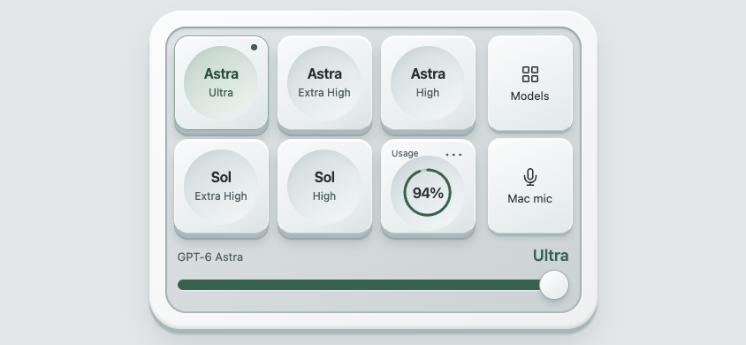
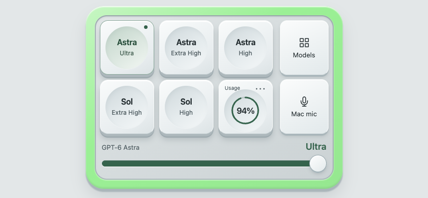
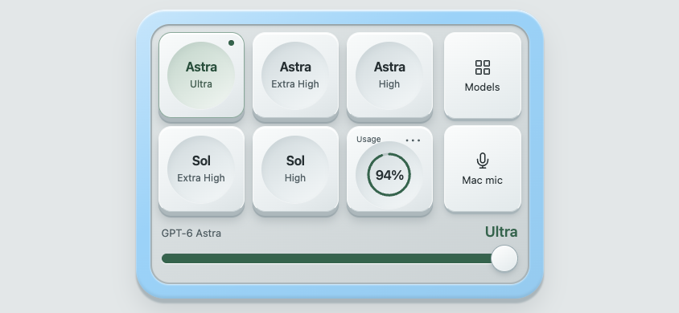
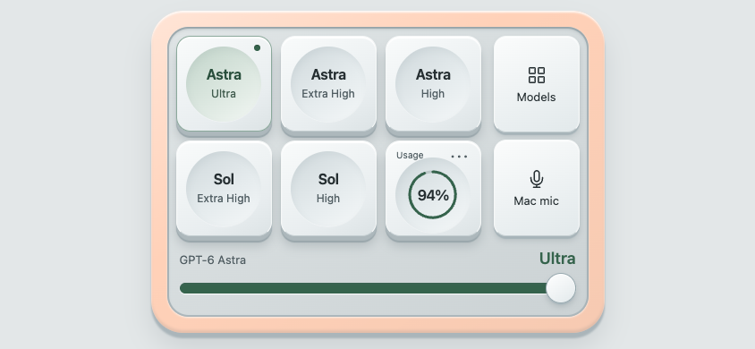
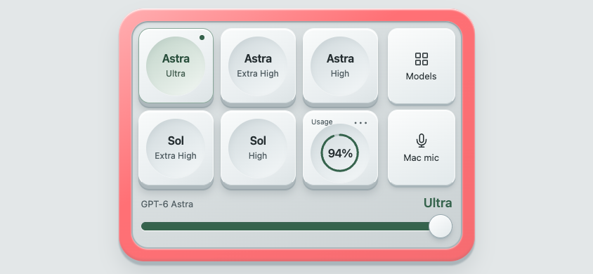

# Micro-style controls in Web Deck

Web Deck keeps the five preset keys and adds a compact control strip for model/effort, Mac dictation, and the active chat’s waiting requests. It runs in the phone browser on the same private Wi-Fi as Codex Deck. It does not require a Codex Micro or Stream Deck device.

For installation, pairing, and JSON preset editing, use the [English README](../README.md#use-your-phone-as-a-web-deck) or [한국어 설명서](../README.ko.md#휴대폰을-web-deck으로-사용하기).

## Controls

| Control | How to use it | Scope |
| --- | --- | --- |
| Five model keys | Read the model family above its reasoning level. Tap a key; wait for the confirmed selection. | Applies the corresponding `presets.json` model and effort to the active saved chat. |
| Usage | Read the percentage in the ring; tap for details, refresh, fullscreen, or disconnect. | Remaining quota, preferring the weekly window. Missing/expired/offline data is `—`. |
| Effort slider | Drag the bar directly on the deck, then release. | Keeps the current model, changing only its effort. For example: preset 1 Astra Ultra → slider High = Astra High. Saved presets stay unchanged. |
| Models / Presets | Toggle between model-name keys and the five saved presets. Tap a model to apply it. | Keeps a supported current effort, falling back to High or the first supported level. Returning to Presets changes only the view. |
| Mac mic / Stop mic | Start dictation; stop when finished. | Uses the Mac microphone and inserts the transcript into the Mac composer without sending. |
| Requests | Review the displayed chat and complete request, then respond. | Only supported pending requests for the active saved chat. |

The grid is 3 × 2 in landscape and 2 × 3 in portrait. The slider stays below the keys. The other controls sit to their right in landscape or below the slider in portrait, without a page header. The slider supports keyboard interaction, and reduced-motion settings remove key movement.

Click feedback is always enabled. A bundled audio clip starts from a user gesture, with a short synthesized fallback; there is no sound preference to toggle or an old mute preference to restore. The page cannot override media volume, a hardware mute setting, or browser playback restrictions. Vibration is used where supported. These differences do not block the action itself.

## Model selection and effort

The deck reads the visible composer’s model options instead of assuming that every account has the same models. Unavailable model choices and unsupported effort levels are rejected. Selecting a model applies it with a supported effort; dragging the always-visible deck slider previews a level and applies it on release, preserving the active model. The Mac verifies the final model and effort before reporting success.

The requested selection stays visible as pending while the Mac responds. Its acknowledgement confirms that same position without reverting to the previous state. While a model write is pending, further slider releases replace a single trailing value; they never start parallel writes. Failure or a changed chat cancels the queue. A soft original tone plays on a button press or slider release, with no per-step tick during dragging.

These controls change subsequent turns of the current chat. They do not restart a running response, send a prompt, or rewrite the five configured presets. Use **Model Presets → Edit Presets…** on the Mac to save a recurring combination.

The bridge requires one unambiguous saved chat with its composer visible. If the target or catalog changes while a control is being used, refresh and check the target in **Usage** before retrying.

## Status frame

Version 0.9.2 adds a broad, beveled outer frame around the gray inner board. It follows the [official Micro status colors](https://learn.chatgpt.com/docs/features/codex-micro), independent of model choice and reasoning effort.

| Color | Meaning | Offline fixture preview |
| --- | --- | --- |
| White | Idle |  |
| Light green | Complete, with an unread update |  |
| Light blue | Thinking / working |  |
| Peach / amber | Requires an answer or approval |  |
| Red | Chat error |  |

The bridge reads the current saved chat’s committed `statusState.type` and `statusState.unread` props, scoped by its conversation ID. Mounted pending requests take precedence, including requests that must be answered on the Mac. A native composer response-in-progress flag can supply Thinking if the task-row status is absent. No transcript, arbitrary hook state, or another chat’s status is used. Missing, changed, or conflicting status shapes produce a neutral gray frame, rather than guessing Idle. Because this relies on internal Codex props, future versions or layouts that omit status can show gray while model controls still work.

The existing five-second visible-page poll updates the frame; no extra timer, status query, perpetual pulse, or continuous animation is added. Reading a completion in Codex clears its unread green state. Connection loss, pairing expiry, and unavailable chats clear stale colors. Model-change acknowledgement and recording state do not impersonate chat completion. **Usage** shows the state in text, and a screen-reader live region announces changes without adding a main-deck header.

These five previews and automated checks use synthetic offline state. They verify the renderer and adapter contracts, not live desktop status or physical-phone integration.

## Dictation and native permissions

**Mac mic** controls Codex’s existing dictation, not the phone microphone and not a realtime voice call. Codex must expose enabled dictation controls, and macOS must allow Codex microphone access. Complete any system prompt on the Mac. The browser cannot grant macOS permissions; it does not call a phone recording API or relay audio to the companion.

When you tap **Stop mic**, Codex finishes transcription and inserts the result into its composer. Review and send the text there. A recording that the deck did not start is shown as **Mic on Mac** and should be stopped in Codex.

Stop explicitly before closing the browser, disconnecting, or stopping the Web Deck server. A network loss or closed phone page may leave Mac recording active. If the deck shows **Mic unknown**, check Codex on the Mac instead of assuming the recording has stopped.

The native source stops its recorder when the owning hook unmounts and includes its own recording limit. Neither behavior establishes that closing a remote browser stops recording. The exposed controls also lack a stable active recording-session ID: a saved stop callback can refer to a later recording in the same composer. The companion therefore does not schedule a delayed stop callback that could interrupt an unrelated recording.

## Pending approvals and questions

The **Requests** control appears when the active chat has a supported pending request. It displays the target chat and full relevant details. Buttons remain tied to that request; the bridge checks the chat, request identity, and full displayed-data fingerprint again immediately before responding.

- **Command approval:** inspect the command, working directory, and any supplied network or policy context. **Allow once** invokes the native request’s accept action; **Deny** invokes its decline action.
- **File-change approval:** inspect the file changes, requested root, and any visualization activity included in the request. The decision applies to that pending change request.
- **Permission request:** inspect the requested permission scope. Approval uses Codex’s current-turn scope; denial does not grant it. There is no always-allow or session-wide switch.
- **User-input question:** select one offered option per question. Use an Other/freeform answer only where the question permits it, then submit all current answers together. A secret input is masked in the form, but still travels over the paired HTTP connection.

This is not a general chat composer. It cannot send arbitrary messages, choose unrelated chats, supply executable code, or grant permissions that were not requested. Plan implementation prompts (`implementPlan`), generic option pickers (`optionPicker`), onboarding/environment forms, unknown structures, and requests too large to show in full are handled on the Mac. The deck does not truncate approval content into a partial review.

A changed or already answered request is rejected. If a submission times out, check the request in Codex before retrying: the native response may have been sent before confirmation failed. See [Security](../SECURITY.md) for pairing, HTTP exposure, revocation, and action validation.

## Research and implementation choice

The official [Codex Micro guide](https://learn.chatgpt.com/docs/features/codex-micro) describes hardware controls for composer navigation, reasoning adjustments, and dictation using the Mac microphone. The [Codex app-server documentation](https://learn.chatgpt.com/docs/app-server) describes structured approvals and user-input requests. The public protocol defines [user-input parameters](https://github.com/openai/codex/blob/main/codex-rs/app-server-protocol/schema/json/ToolRequestUserInputParams.json) and [answer payloads](https://github.com/openai/codex/blob/main/codex-rs/app-server-protocol/schema/json/ToolRequestUserInputResponse.json).

These open-source projects were reviewed for interaction and transport approaches:

| Project | Relevant approach | License at reviewed revision |
| --- | --- | --- |
| [maxxspotter/codex-micro-app](https://github.com/maxxspotter/codex-micro-app/tree/cf323ada1e9716073d0748caea503f6e0974ba1c) | Phone interface, local bridge, model/effort controls, approvals, and Mac dictation. | MIT |
| [mpociot/codex-micro-stream-deck-emulator](https://github.com/mpociot/codex-micro-stream-deck-emulator/tree/7093bd48f0bcb953f623b40c727470e545b48df3) | Stream Deck device emulation and an injected HID shim. | MIT |
| [dazer1234/codex-stream-deck](https://github.com/dazer1234/codex-stream-deck/tree/6d7d14b9c966de305617a43a7ac22c7034ac075e) | Stream Deck actions that route Micro events through a desktop bridge. | MIT |

These are research references, not runtime dependencies. No code or proprietary hardware assets were copied from them. Codex Deck extends its existing direct composer bridge, uses the native control/request callbacks, and checks the resulting state. It does not install a HID emulator, inject a `node-hid` shim, pretend hardware is connected, or override feature gates.

The public app-server protocol is useful for understanding request shapes, but a separately launched server does not own the pending request in an existing Codex desktop chat. This version therefore uses the currently mounted desktop request’s callback. That is an internal integration, not a supported public remote-control API; Codex updates can change it.

## Verification and current limits

For 0.8.0, static Codex source informed the adapter, isolated fixtures exercise the bridge and HTTP contracts, and a real browser was used to inspect the responsive interface and simulated actions. The screenshots in the README use fixture data. They do not establish live Codex compatibility, native microphone capture, or physical-phone audio/haptics behavior; those were not validated for this release.

You can inspect the interface without connecting to Codex:

```bash
swift run CodexUsageWebFixture
```

Open the printed loopback pairing URL. This serves the actual page with **Fixture chat**, a simulated model catalog and recording state, and sample approval/question requests. No microphone is used, command executed, or Codex message sent. Restart the fixture to reset its state and pairing link.

For normal use, keep one saved chat open, enable direct switching, and pair from **Web Deck…**. First check a model change in the Mac composer. Then verify dictation start/stop and a supported pending request you can review on the Mac. If a control is unavailable or its result is uncertain, use Codex directly; the companion should not silently fall back to another chat or action.
